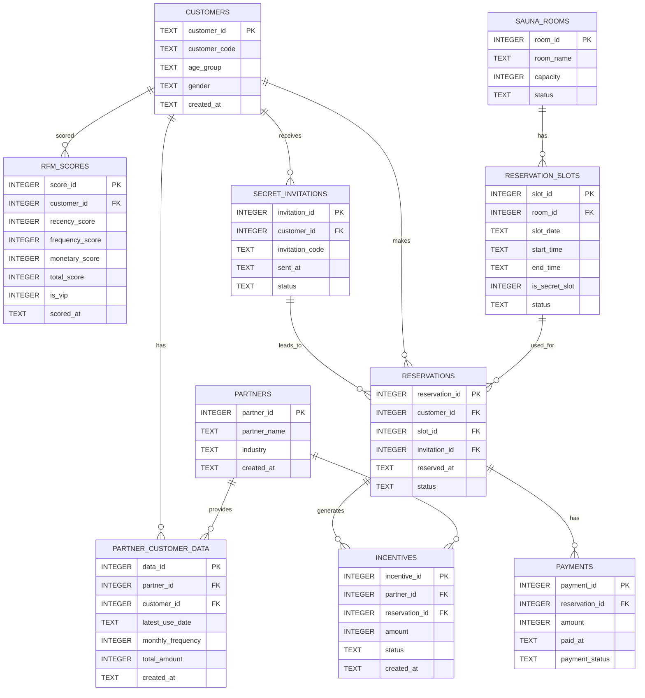

# ER図

## 概要

このER図は、個室サウナ向けVIP送客システムのデータベース構造を示す。

提携先企業から連携された顧客データをもとにRFM分析を行い、VIP顧客を抽出する。
その後、VIP顧客にシークレット招待を送り、予約・決済・紹介手数料の管理を行う。

## 関係の説明

* partners と partner_customer_data は、提携先企業が顧客データを提供する関係である。
* customers と rfm_scores は、顧客ごとにRFMスコアを持つ関係である。
* customers と secret_invitations は、VIP顧客に招待を送る関係である。
* sauna_rooms と reservation_slots は、各サウナ部屋に予約枠が存在する関係である。
* reservation_slots と reservations は、予約枠に対して実際の予約が入る関係である。
* reservations と payments は、予約に対して決済が発生する関係である。
* reservations と incentives は、予約・利用実績に応じて紹介手数料が発生する関係である。
