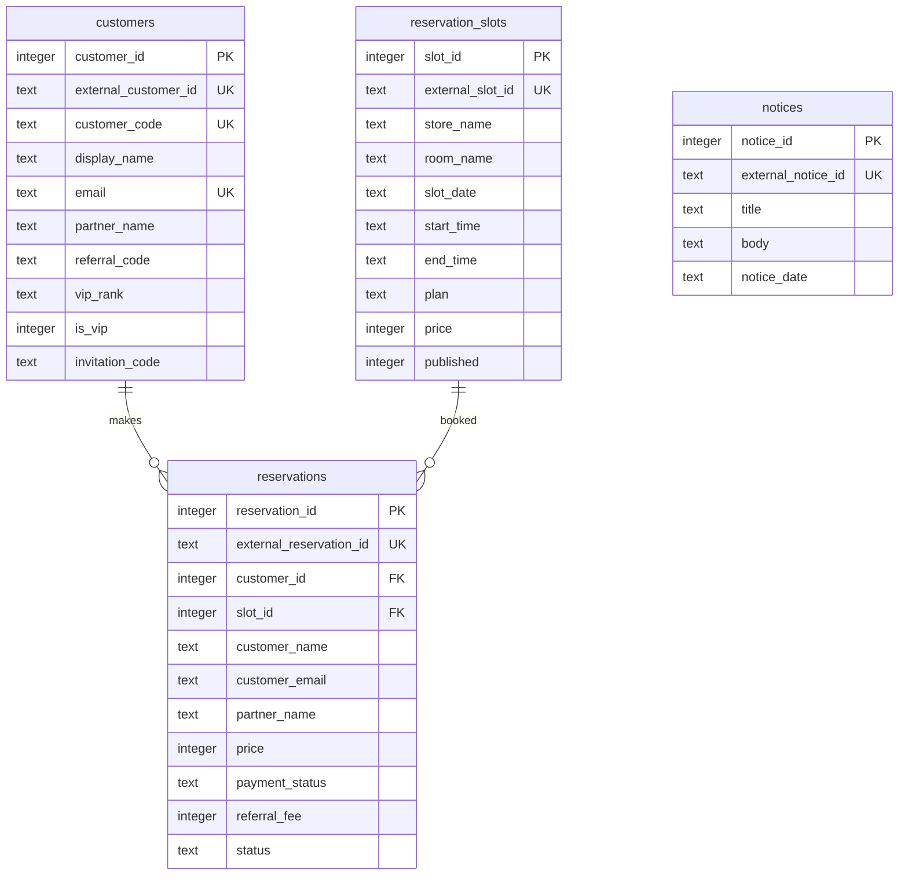

# ER 図

実テーブルは 4 つだけです。お知らせは独立しており、予約は顧客と予約枠を参照します。

```mermaid
erDiagram
    customers ||--o{ reservations : makes
    reservation_slots ||--o{ reservations : booked

    customers {
        integer customer_id PK
        text external_customer_id UK
        text customer_code UK
        text display_name
        text email UK
        text partner_name
        text referral_code
        text vip_rank
        integer is_vip
        text invitation_code
    }

    reservation_slots {
        integer slot_id PK
        text external_slot_id UK
        text store_name
        text room_name
        text slot_date
        text start_time
        text end_time
        text plan
        integer price
        integer published
    }

    reservations {
        integer reservation_id PK
        text external_reservation_id UK
        integer customer_id FK
        integer slot_id FK
        text customer_name
        text customer_email
        text partner_name
        integer price
        text payment_status
        integer referral_fee
        text status
    }

    notices {
        integer notice_id PK
        text external_notice_id UK
        text title
        text body
        text notice_date
    }
```
